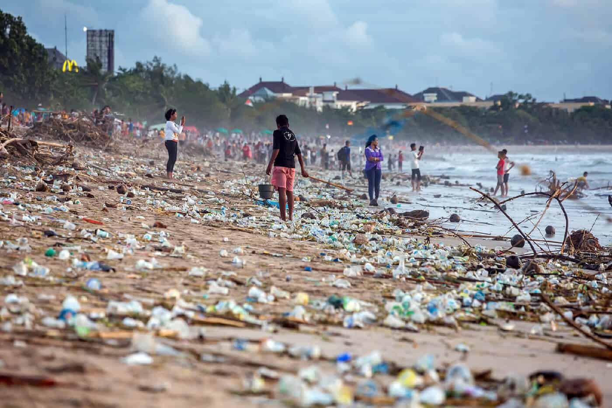

## Abstract
Abstract—This study combines photo metadata and computer vision to quantify where uncollected litter is present. Images from the Trash Annotations in Context (TACO) dataset were used to teach an algorithm to detect 10 categories of garbage. Although it worked well with smartphone photos, it struggled when trying to process images from vehicle mounted cameras. However, increasing the variety of perspectives and backgrounds in the dataset will help it improve in unfamiliar situations. These data are plotted onto a map which, as accuracy improves, could be used for measuring waste management strategies and quantifying trends.

## The Problem
The world is increasingly relying on plastics for food packaging, electronics, single use containers, etc. In the 1960s they made up less than 1% of municipal solid waste, by 2005 this number rose to 10%. Post-consumer waste alone accounts for about 5% of total greenhouse gas emissions each year and costs over $200 billion each year. The world bank estimated the global waste production will continue to double roughly every decade, and won't plateu until the end of the century.

## Our Research
Based on recent advances in computer vision, an automated trash detection system could help answer these two questions: Where is waste located? How much is there? This is done by leveraging images from smartphones and dashcams to analyze specific geographic areas. With only a few dedicated vehicles, daily or weekly, snapshots could be taken to show how much litter there is over time. This information will be used to produce a human readable map that could be used by policy makers and non-profit organizations to evaluate and improve litter reduction programs.

## Algorithm: Mask R-CNN
This research uses Masked Regional Convolutional Neural network (Mask R-CNN), a computer vision algorithm that was made open source by Facebook in 2018. This performs both object detection (placing it into a category), and instance segmentation (creating an outline of where it is). Although training is a long process, detection only takes a few seconds, and can be run on a small mobile device with fast results.

## Datasets
### TACO
The Trash Annotations in Context (TACO) dataset contains publicly uploaded images of litter that have been outlined and labeled [Fig 1]. It was used in combination with data augmentation to achieve an average accuracy score of 86%. TACO contains 1500 images with 4,784 individually outlined objects.

### Mapillary
Mapillary converts community submitted dash cam footage into a collection of images covering the road network, and scrubs any personally identifiable information such as faces and license plates. If detection accuracy is high enough then the data in these images could be quickly processed to locate what streets have the most trash and are most in need cleaning up. 

### CSUS Clean Up
The second output dataset consists of hand collected images of trash that were cleaned up at California State University, Sacramento. These were taken using an iPhone 11 before the trash was disposed of. This dataset is representative of what a volunteer organization could collect to estimate categorized totals and gain other insights into their work. 

## Location Estimation
Each detection was placed on a map allowing these data to be accessible to waste management organizations and policy makers in an easily understandable format. The coordinates and camera orientation were extracted from the image’s exif metadata and used to estimate the camera viewing angle. Next the outline generated by Mask R-CNN was used to horizontally place that detection into the camera’s perspective cone.

 
 
 ## Results

When evaluating 150 smartphone images a precision of 80% and recall of 73% [Table 2] are achieved, which is close to results seen by researchers using different algorithms on the same dataset [12].  However, the same model scored 1% and 3% respectively [Table 3] when run on 200 images from Mapillary in the neighborhood surrounding California State University, Sacramento. 

Combining the detections from the pretrained model and the images’ metadata, two maps were created showing the detections from each dataset. Fig. 5 shows the waste cleaned up for the smart phone dataset and where it was found. It clearly outlines the loop that was walked around the main campus buildings, as well as a few scattered detections that come from early testing data. Mapillary image results from the community surrounding the university are shown in Fig. 6. As accuracy improves, computer vision generated maps like this could be used to help organizations plan what areas should be cleaned up.

### Issues

Although the accuracy on the Mapillary images was low, results from the smartphone images was similar to previous research. This accuracy discrepancy between datasets is likely due to three issues: the camera pixel densities, the training dataset perspective, and misclassified unfamiliar objects. Modern smartphones have very high-definition cameras which provide a high level of detail and clarity. However, the dashcam images used had a lower pixel count, and because they were originally videos, some details may be lost due to video compression. The model previously struggled with detecting lower resolution objects with less than 20 x 20 pixels. Cigarettes, for example, have the second most labeled instances, and are generally uniform in color and appearance, so the model should be able to recognize them very easily. However, because of the small size, it had difficulty extracting features it could use to accurately distinguish them from leaves and other background objects. Because the images in the training dataset are mostly smartphone pictures, they are usually taken very close to the objects and from above. This can cause the model to overfit to this perspective, and not generalize its understanding of trash to a horizontal, road facing camera. Additionally, the trash in the Mapillary images tended to be within the range of 10 to 30 feet, making them appear much smaller and decreasing the model’s confidence.

Lastly, there were specific objects the model hadn’t seen during training that it routinely misclassified as trash. The largest cause of FPs was cars being labeled as a can with pop tabs for wheels, which made up 50% of FPs [Fig. 7]. The model could more accurately label cars as TN if the training dataset contained more images with labeled waste in the foreground and cars in the background.

 ## Future Work

Several issues were outlined after analyzing results, these will need to be addressed to increase the accuracy to an acceptable level. To fix the pixel density issue a higher resolution dataset could be used, or better cameras could scan and update Mapillary to improve the image detail. Additionally, adding new images to the TACO dataset that are from Mapillary will allow it to learn a more generalized concept of what waste will look like in new perspectives. To improve location estimation multiple images could be combined to triangulate the position. As these improvements are made, more accurate maps of communities could quickly be generated to show where litter is located with a high level of detail.

 ## Conclusion

This research demonstrates how computer vision can be used to aid volunteers in finding what areas have the most litter [Fig. 6] and measuring how much of that waste gets removed during a cleanup [Fig. 5]. These techniques will help reduce the amount of litter in the environment, which has been rapidly increasing due to a combination of high waste production, and low collection rates. This can harm animals, be a health risk for surrounding communities, and cause environmental hazards. While trash clean-up activities can help collect and dispose of litter, they are expensive, and thus usually only focus on especially dirty areas. Using computer vision to quantify trash levels in different communities would help these organizations focus their efforts where they’re most needed. Because global waste production isn’t predicted to plateau until the end of the century, new technologies such as this, are needed to help clean up trash faster than it’s being littered.
